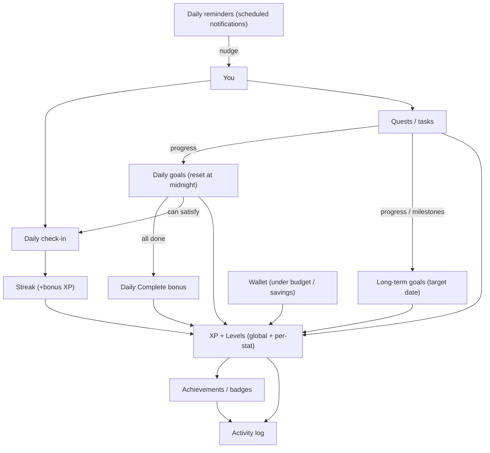
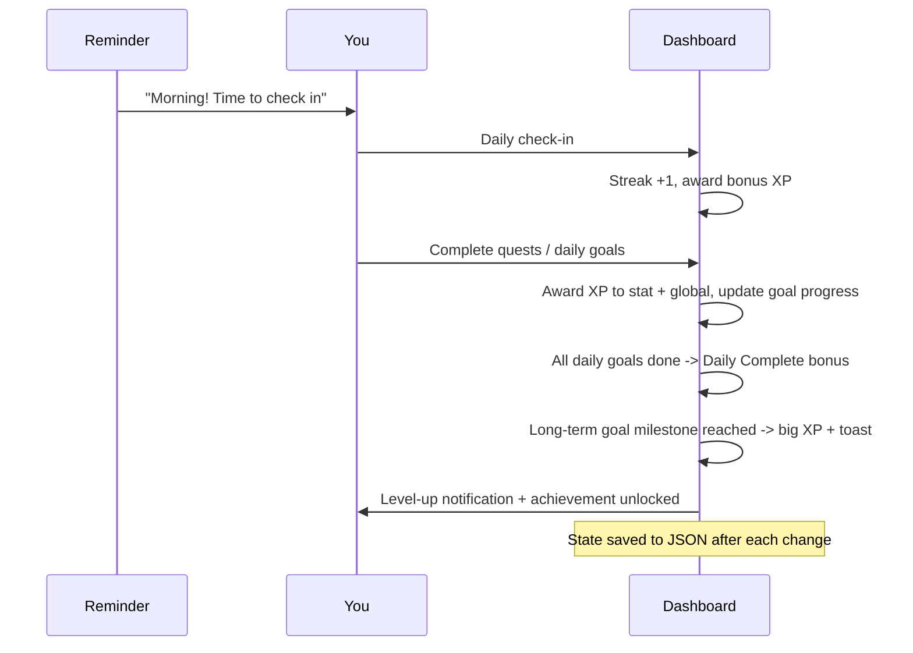

# Player Dashboard — Feature Map

This document explains the dashboard's features and, importantly, **how they blend
together** into a single gamification loop. For architecture/process details see
[PROCESS.md](PROCESS.md); for setup see the [README](../README.md).

---

## The big picture

Everything funnels into one reward layer (XP, levels, achievements, activity log).
**Quests** are the smallest unit of action. **Daily goals** and **long-term
goals** are containers that quests/actions feed into. **Check-ins** and
**streaks** reward showing up. **Reminders** pull you back into the loop.

> All of the above lives behind a **local login**: each account has its own
> separate copy of this entire loop and data. See "Local accounts & login" below.

---

## Features in detail

### Daily reminders
- Configurable reminders, each with a **label**, **time of day**, and optional
  **days of week**.
- The Electron main process schedules them and fires native desktop
  notifications, then reschedules for the next occurrence.
- Includes a built-in **check-in reminder** you can edit or disable.
- Purpose in the loop: the *nudge* that brings you back to act.

### Daily check-ins
- One click per day to confirm you showed up.
- Drives the **streak** (consecutive days) and awards bonus XP.
- Can be auto-satisfied by completing all of today's daily goals.

### Daily goals
- A focused set of goals for **today** that **auto-reset at midnight**.
- Completing one grants XP; completing **all** grants a "Daily Complete" bonus.
- Yesterday's result is recorded before the reset (for history/achievements).
- Purpose in the loop: short-term focus and momentum.

### Long-term goals
- Bigger, aspirational goals with a **title**, optional **target date**, and
  **milestones**.
- A **progress bar** fills as linked quests/daily goals complete, or via manual
  progress updates.
- Hitting a milestone or finishing the goal grants larger XP and a celebratory
  toast/achievement.
- Purpose in the loop: direction and meaning behind the daily actions.

### Quests / tasks
- The atomic actions that grant XP to a chosen **stat** and the **global** level.
- Cadence: daily, weekly, or one-off.
- Feed progress into daily goals and long-term goals.

### Shared reward layer
- **XP + Levels**: a global level plus per-stat levels using a super-linear curve.
- **Achievements / badges**: unlocked by milestones (first quest, 7-day streak,
  reach Level 5, complete a long-term goal, etc.).
- **Activity log**: a running history of XP gains, completions, and unlocks.

### Local accounts & login
Gates the whole app; fully local (no server):

- **Sign-up / login**: multiple users can keep separate accounts on one machine,
  each with its own data file.
- **Security**: passwords are hashed with `crypto.scrypt` + a per-account salt in
  the main process; the renderer never sees hashes. (Local convenience auth, not
  encryption-at-rest.)
- **Session**: after login only that user's data loads; logout returns to the
  login screen.

### Wallet (salary budget)
A money tracker framed as part of the game:

- **Monthly salary** auto-credits to your balance each new month.
- **Transactions**: log income/expense entries by category; balance updates live.
- **Monthly summary**: income, expenses, savings, and spend-vs-budget by category.
- **XP tie-in**: staying under budget and saving grant XP and unlock wallet
  achievements (e.g. "First paycheck", "Under budget", "Saved 3 months").

### Profile & customization
The Profile tab is the settings/customization hub (it sits alongside the feature
loop rather than inside it):

- **Identity**: edit your name, title/class, and avatar; the top-bar summary
  updates live.
- **Appearance**: pick a **theme** (rpg/modern/cyberpunk/minimal) and a **layout**
  (grid/compact/sidebar/single-column) independently. Both apply instantly and
  persist in `settings`.
- **Data management**: **Export** your entire state to a `.json` backup,
  **Import** a backup to restore it, or **Reset** to first-run defaults. These run
  through the Electron main process via native file dialogs.

---

## How a typical day flows

---

## Lifecycle / timing rules

- **Login**: on launch you authenticate; only the logged-in account's data loads.
- **Midnight rollover**: on launch and via a timer, daily goals reset and
  yesterday's completion is archived; the streak breaks if a day was missed.
- **Month rollover**: the wallet auto-credits the monthly salary and finalizes the
  previous month's budget/savings (which may grant XP).
- **Reminders**: scheduled in the main process; re-synced whenever you add, edit,
  or remove one in the UI.
- **Persistence**: every change is written to the local JSON store so progress
  survives restarts (see [PROCESS.md](PROCESS.md#7-persistence-flow)).

---

## Related documents

- [README.md](../README.md) — overview and setup.
- [PROCESS.md](PROCESS.md) — architecture, data model, and security.
- [IMPLEMENTATION.md](IMPLEMENTATION.md) — step-by-step build guide per feature.
