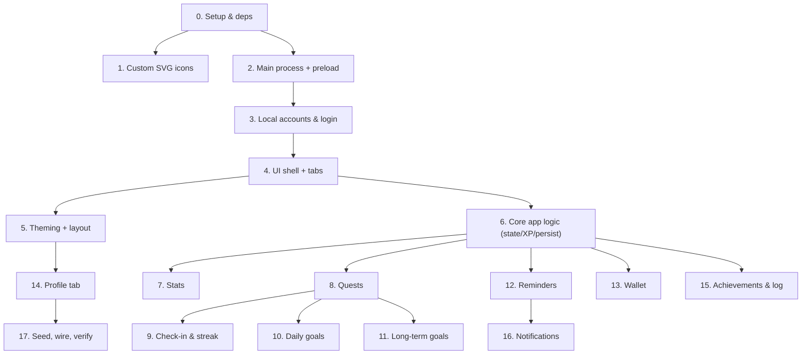
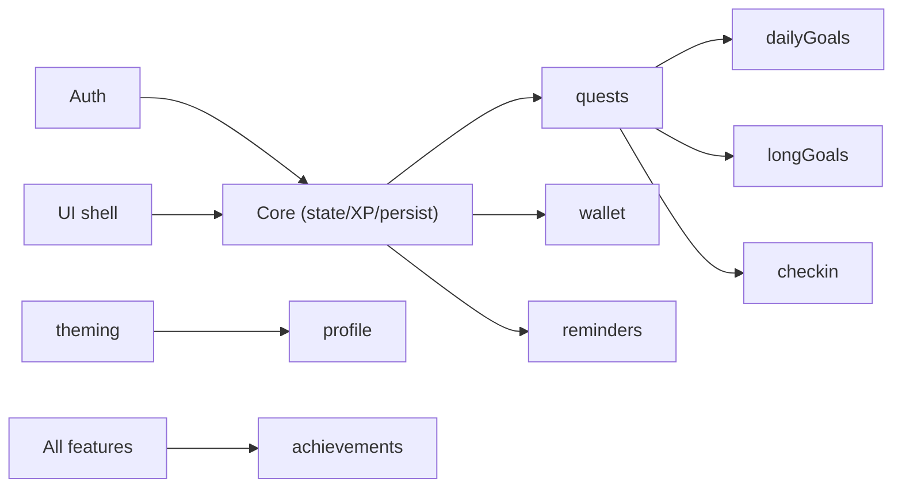

# Player Dashboard — Step-by-Step Implementation Plan

A concrete, per-feature build guide. Features are ordered by dependency: earlier
ones unlock later ones. Each section lists **prerequisites**, **files**,
**steps**, and **done when** (acceptance checks).

See also: [README](../README.md) · [PROCESS](PROCESS.md) · [FEATURES](FEATURES.md).

Suggested branch per feature already exists (e.g. `feature/custom-svg-icons`,
`feature/login-auth`, `feature/wallet`, ...). Work a feature on its branch, then
merge into `dev`.

---

## Build order at a glance

---

## 0. Project setup & dependencies

**Files:** [package.json](../package.json), `.gitignore`

**Steps:**
1. Add dev deps for icon conversion: `npm i -D sharp png-to-ico`.
2. Add npm scripts: `"build:icons": "node scripts/build-icons.js"` and
   `"prestart": "npm run build:icons"`.
3. Create/append `.gitignore` with `assets/generated/` and `node_modules/`.
4. Confirm `"main": "main.js"` and `"start": "electron ."` are present.

**Done when:** `npm start` still launches the current window and `npm run build:icons` runs (even if a no-op for now).

---

## 1. Custom SVG icon system

**Prereqs:** 0. **Files:** `assets/icons/*.svg`, `scripts/build-icons.js`, `assets/generated/` (created at build).

**Steps:**
1. Create `assets/icons/` and add starter SVGs with the fixed names: `app.svg`,
   `notify.svg`, `avatar.svg`, and `tab-*.svg` (`stats, quests, checkin, goals,
   wallet, reminders, achievements, activity, profile`).
2. Write `scripts/build-icons.js`:
   - Use `sharp` to render `app.svg` to PNG buffers at 16/32/64/128/256.
   - Write `assets/generated/icon.png` (256) and use `png-to-ico` to write
     `assets/generated/icon.ico`.
   - Render `notify.svg` to `assets/generated/notify.png` (e.g. 128).
   - Create the `assets/generated/` dir if missing; log what was written.
3. In `dashboard.js` (later), tabs read `assets/icons/tab-<id>.svg` inline; build
   a small helper `loadTabIcon(id)` with a built-in fallback SVG string.

**Done when:** running `npm run build:icons` produces `assets/generated/icon.ico`, `icon.png`, `notify.png` from the SVGs.

---

## 2. Electron main process + preload (security)

**Prereqs:** 1. **Files:** [main.js](../main.js), `preload.js`

**Steps:**
1. In `main.js`, set the `BrowserWindow` `icon` to `assets/generated/icon.png`
   (and `.ico` on Windows). Add `webPreferences: { preload, contextIsolation: true, nodeIntegration: false, sandbox: false }`.
2. Create a `store.js` helper (or inline): resolve paths in `app.getPath('userData')`,
   with atomic JSON read/write helpers (`readJson`, `writeJsonAtomic`).
3. Register baseline IPC handlers (`ipcMain.handle`): `state:load`, `state:save`,
   `notify`. (Auth, reminders, data, wallet handlers added in later sections.)
4. Write `preload.js` exposing `window.api` via `contextBridge` with thin wrappers
   over `ipcRenderer.invoke`. Start with `loadState`, `saveState`, `notify`.

**Done when:** the renderer can call `window.api.saveState({})` / `loadState()` round-trip to a JSON file in `userData`, with DevTools showing no context-isolation errors.

---

## 3. Local accounts & login (local-only, multi-user)

**Prereqs:** 2. **Branch:** `feature/login-auth`. **Files:** `main.js`, `preload.js`, `htmlFiles/index.html`, `htmlFiles/dashboard.js`

**Data:** `accounts.json` = `{ accounts: [{ id, username, salt, passwordHash, createdAt }] }`; per-user `player-data-<id>.json`.

**Steps:**
1. In `main.js` add an auth module:
   - `hashPassword(password, salt)` using `crypto.scrypt` (async) returning hex.
   - `auth:list` → return usernames + ids only (never salt/hash).
   - `auth:signup(username, password)` → reject duplicate username; generate
     `crypto.randomBytes(16)` salt; hash; append to `accounts.json`; create a
     seeded `player-data-<id>.json`; set session; return `{ id, username }`.
   - `auth:login(username, password)` → look up user; recompute hash; compare with
     `crypto.timingSafeEqual`; on success set `session.userId`; return profile.
   - `auth:logout` → clear `session.userId`.
2. Make `state:load`/`state:save` operate on `session.userId`'s file; reject if no session.
3. In `preload.js` add `listAccounts`, `signup`, `login`, `logout`.
4. In `index.html` add a login/sign-up view (toggle between modes) and a hidden
   dashboard container.
5. In `dashboard.js` add `initAuth()`: on load call `listAccounts()`; show sign-up
   if none, else login; on success hide the auth view, call `bootDashboard()`.
   Add a logout button wiring to `logout()` then back to the auth view.

**Done when:** signing up creates an account + data file; logging in loads only that user's data; wrong password is rejected; logout returns to the login screen; a second account keeps separate data.

---

## 4. UI shell + tab navigation

**Prereqs:** 3. **Branch:** `feature/ui-shell`. **Files:** `htmlFiles/index.html`

**Steps:**
1. Build the top bar: avatar, name, title, global level + XP bar, logout button.
2. Build a tab bar / nav with one entry per panel (Stats, Quests, Check-in,
   Daily Goals, Long-term Goals, Wallet, Reminders, Achievements, Activity,
   Profile), each rendering its inline `tab-*.svg`.
3. Add empty panel containers (one per tab) inside a `.panels` wrapper, and a
   simple tab-switching mechanism (show/hide active panel).
4. Add modal skeletons: Add Quest, Add Goal, Add Reminder, Add Transaction.

**Done when:** all tabs render with their SVG icons and switch panels; modals open/close; layout is responsive.

---

## 5. Theming + layout system

**Prereqs:** 4. **Branch:** `feature/theming`. **Files:** `htmlFiles/styles.css`

**Steps:**
1. Remove the duplicate reset blocks in the existing CSS.
2. Define base CSS variables, then override per `[data-theme="rpg|modern|cyberpunk|minimal"]`.
3. Add `[data-layout="grid|compact|sidebar|single"]` rules controlling the
   `.panels` container arrangement.
4. Style shared components: cards, XP bars, buttons, modals, toasts, login screen.
5. Apply `data-theme`/`data-layout` from `settings` on boot (wired in step 6/14).

**Done when:** setting `document.documentElement.dataset.theme` / `dataset.layout` instantly restyles/re-lays the app across all four themes and four layouts.

---

## 6. Core app logic (state, XP/levels, persistence)

**Prereqs:** 3, 4. **Branch:** `feature/app-logic`. **Files:** `htmlFiles/dashboard.js`

**Steps:**
1. Define the default state factory `defaultState()` (profile, settings, stats,
   quests, dailyGoals, longGoals, reminders, wallet, streak, achievements, log).
2. On `bootDashboard()`: `state = await window.api.loadState()` (or defaults);
   apply theme/layout; render all panels.
3. Implement `save()` (debounced) → `window.api.saveState(state)`; call after
   every mutation.
4. Implement XP math: `xpForLevel(level)=Math.floor(100*level**1.5)`,
   `addXp(target, amount)` handling level-up + overflow, returning level-up info.
5. Implement a `toast(msg)` helper and an `addLog(text)` helper.
6. Implement `render()` dispatch that re-renders panels from `state`.

**Done when:** state loads/persists across restarts; `addXp` correctly levels up with overflow and shows a toast.

---

## 7. Stats

**Prereqs:** 6. **Files:** `dashboard.js`, `index.html`

**Steps:**
1. Seed default stats (e.g. Strength, Intellect, Discipline, Social, Health).
2. Render each stat as a card with level + XP bar.
3. (Optional) allow add/rename/remove stats from the UI.

**Done when:** stats render with correct level/XP bars and update when XP is added.

---

## 8. Quests / tasks

**Prereqs:** 6, 7. **Branch:** `feature/quests`. **Files:** `dashboard.js`, `index.html`

**Steps:**
1. Add Quest modal: title, target stat, XP reward, cadence (daily/weekly/one-off).
2. `addQuest`, `toggleQuest`, `deleteQuest`. Completing a quest calls
   `addXp(stat,...)` + `addXp(global,...)`, logs it, runs achievement checks.
3. Render quest list grouped by cadence with complete/delete controls.

**Done when:** adding and completing a quest awards XP to the stat + global level and appears in the activity log.

---

## 9. Daily check-in & streak

**Prereqs:** 6. **Files:** `dashboard.js`, `index.html`

**Steps:**
1. Implement `checkIn()` comparing today to `streak.lastCheckIn`:
   same day no-op; yesterday → `count++` + bonus XP; older → reset to 1.
2. Render the check-in button + current streak; disable if already done today.

**Done when:** checking in increments the streak once per day, awards bonus XP, and resets if a day is missed.

---

## 10. Daily goals

**Prereqs:** 6, 8. **Branch:** `feature/daily-goals`. **Files:** `dashboard.js`, `index.html`

**Steps:**
1. Add Goal modal (daily mode): title + XP.
2. CRUD + `toggleDailyGoal` (awards XP).
3. `rolloverDailyGoals()`: on boot and via a midnight timer, if `lastReset` < today,
   archive yesterday's result, reset `done=false`, set `lastReset=today`.
4. "All complete" → "Daily Complete" bonus XP and optionally auto-`checkIn()`.

**Done when:** daily goals reset at midnight, completing all grants the bonus, and completion can satisfy the check-in.

---

## 11. Long-term goals

**Prereqs:** 6, 8. **Branch:** `feature/long-term-goals`. **Files:** `dashboard.js`, `index.html`

**Steps:**
1. Add Goal modal (long-term mode): title, target date, milestones, XP.
2. CRUD + milestone toggles; compute `progress` from milestones or manual updates.
3. Render a progress bar + milestone checklist + target date countdown.
4. Milestone/goal completion → larger XP + celebratory toast/achievement.

**Done when:** progress reflects milestone/quest completion and finishing grants the big XP reward.

---

## 12. Daily reminders

**Prereqs:** 2, 6. **Branch:** `feature/daily-reminders`. **Files:** `main.js`, `preload.js`, `dashboard.js`, `index.html`

**Steps:**
1. In `main.js` add a scheduler: `setReminders(list)` clears existing timers and,
   for each enabled reminder, computes the next `{time, days}` occurrence with
   `setTimeout`, fires a `Notification` (icon `assets/generated/notify.png`), then
   reschedules for the next day.
2. Add IPC `reminders:set` and `preload` `setReminders`.
3. Add Reminder modal (label, time, days-of-week, enabled); CRUD in `dashboard.js`.
4. On any reminder change (and on boot), call `window.api.setReminders(state.reminders)`.
5. Seed a default check-in reminder.

**Done when:** a reminder fires a desktop notification at its configured time and re-syncs after edits.

---

## 13. Wallet (salary budget)

**Prereqs:** 6. **Branch:** `feature/wallet`. **Files:** `dashboard.js`, `index.html`

**Data:** `wallet = { currency, monthlySalary, balance, budget, lastSalaryCredit, categories[], transactions[] }`.

**Steps:**
1. Wallet setup UI: salary, currency, budget, manage categories.
2. `creditSalaryIfDue()`: on boot/month rollover, while current month > month of
   `lastSalaryCredit`, add salary to balance, log an income transaction, advance
   `lastSalaryCredit`.
3. Add Transaction modal (type, amount, category, note); `addTransaction`,
   `deleteTransaction`, recompute `balance`.
4. `monthlySummary()`: aggregate current month income/expense/savings + by-category;
   compute remaining budget.
5. XP tie-in: `finalizeMonth()` grants XP for under-budget / positive savings and
   evaluates wallet achievements; render summary with a budget bar.

**Done when:** salary auto-credits monthly, transactions update balance + summary, and under-budget/savings grant XP and unlock wallet achievements.

---

## 14. Profile & customization tab

**Prereqs:** 5, 6. **Branch:** `feature/profile-tab`. **Files:** `main.js`, `preload.js`, `dashboard.js`, `index.html`

**Steps:**
1. Identity form: name, title, avatar; on change update `state.profile` + top bar.
2. Theme picker + layout picker → set `data-theme`/`data-layout`, persist to
   `state.settings`.
3. Data management: in `main.js` add `data:export` (`dialog.showSaveDialog` → write
   state), `data:import` (`dialog.showOpenDialog` → read + validate → return),
   `data:reset` (confirm → reseed). Add `preload` `exportData/importData/resetData`.
4. Wire buttons; on import replace state + re-render; on reset reseed defaults.
5. Add a logout control here too.

**Done when:** identity edits reflect live; theme/layout persist; export writes a backup, import restores it, reset reseeds.

---

## 15. Achievements & activity log

**Prereqs:** 6 (then after each feature). **Files:** `dashboard.js`, `index.html`

**Steps:**
1. Define achievement list + condition checks (`checkAchievements(state)`), run
   after every mutating action; unlocked → toast + notification + log entry.
2. Render the badge grid (locked/unlocked) and the activity log feed.

**Done when:** milestones unlock badges once, with a toast/notification and a log entry.

---

## 16. Desktop notifications

**Prereqs:** 2, 12. **Files:** `main.js`, `preload.js`, `dashboard.js`

**Steps:**
1. Ensure `notify` IPC creates an Electron `Notification` with the generated icon.
2. Fire on level-ups, achievement unlocks, and reminders.
3. On Windows, set `app.setAppUserModelId(...)` so notifications show the app name/icon.

**Done when:** level-ups, achievements, and reminders all produce desktop notifications with the custom icon.

---

## 17. Seed, wire, and verify

**Prereqs:** all. **Files:** all

**Steps:**
1. Ensure `defaultState()` seeds sensible stats/quests/daily goals/reminders/wallet
   categories for each new account.
2. (Optional) reference Tailwind utilities; otherwise confirm hand-rolled CSS covers everything.
3. Full pass `npm start` against the verification checklist below.

**Verification checklist:**
- Sign-up/login/logout; per-account data isolation.
- Custom SVGs in tabs/app icon/notifications.
- Theme + layout switch and persist.
- Quests/daily goals award XP + level-ups; daily goals reset at midnight.
- Long-term goal progress + milestones.
- Wallet salary auto-credit, transactions, summary, XP tie-in.
- Reminders fire on schedule; check-in streak works.
- Export/import/reset; data persists across restart.

---

## Dependency summary

