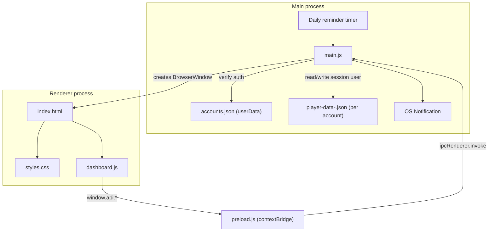
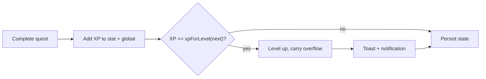
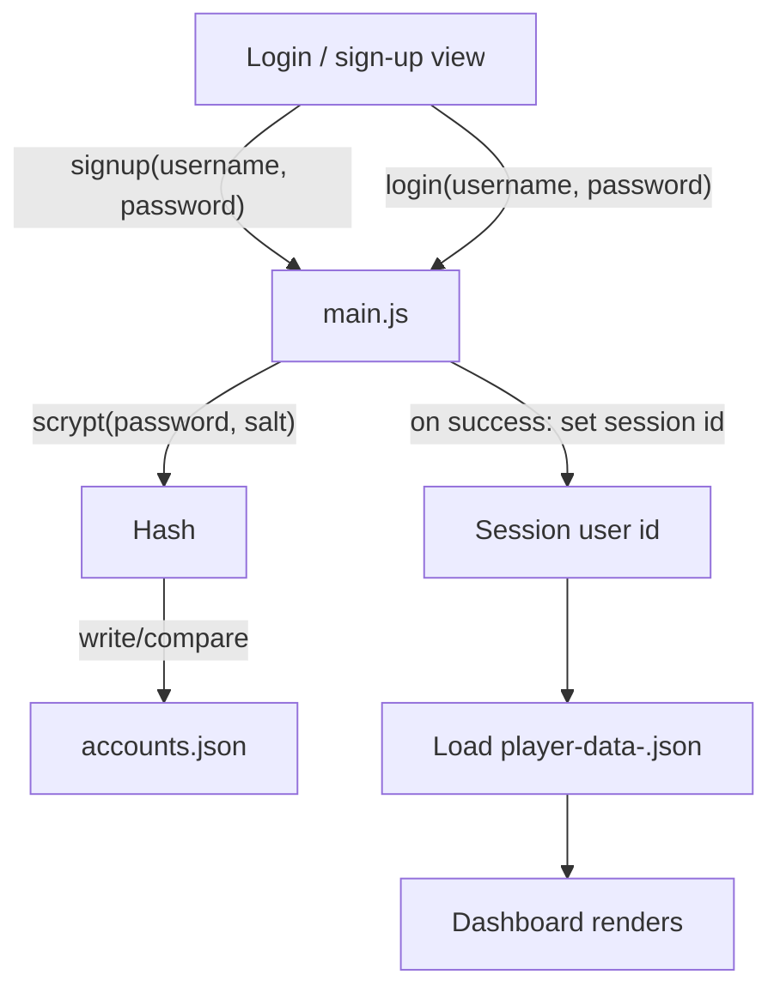
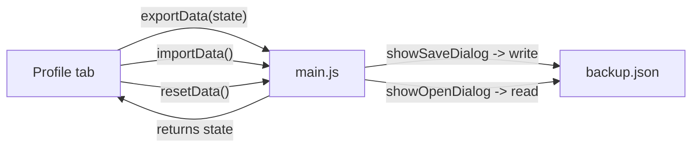
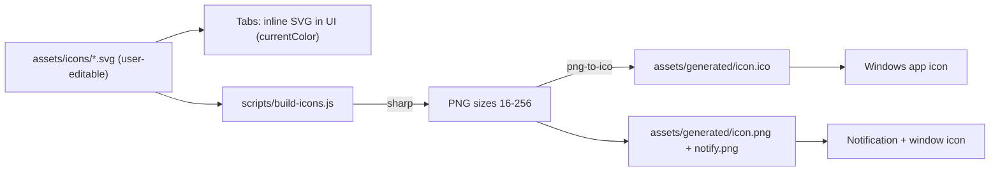

# Player Dashboard — Process & Architecture Documentation

This document explains **how the Player Dashboard works**: its architecture, the
data flow between processes, the core game mechanics, and the development process
used to build it. It is the companion to the user-facing [README](../README.md).

---

## 1. Overview

Player Dashboard is a desktop application built on **Electron**. It reframes
real-life goals as a role-playing game: you have a character with a level and XP,
multiple stats, quests to complete, daily check-ins, streaks, and achievements.

Design priorities:

- **Local-first** — no server; local accounts and all data live on the user's machine.
- **Secure by default** — `contextIsolation` on, no `nodeIntegration` in the renderer.
- **Instant theming** — visuals are driven by CSS variables and a `data-theme` attribute.
- **Zero-friction gamification** — adding/completing quests and checking in are one click.

---

## 2. Architecture

Electron runs two kinds of processes. The **main process** has full OS/Node access;
the **renderer** runs the UI in a Chromium window and is sandboxed. A **preload**
script bridges them safely.



### Responsibilities

- **`main.js` (main process)**
  - Creates the `BrowserWindow` and loads `htmlFiles/index.html`.
  - Registers IPC handlers: `auth:list`, `auth:signup`, `auth:login`,
    `auth:logout`, `state:load`, `state:save`, `notify`, `reminders:set`,
    `data:export`, `data:import`, `data:reset`.
  - Owns local accounts (`accounts.json`) and hashes/verifies passwords with
    `crypto.scrypt`; tracks the current session user.
  - Reads/writes the current user's `player-data-<id>.json` in
    `app.getPath('userData')`, and handles export/import via native save/open
    dialogs.
  - Sends native desktop notifications and runs the **reminder scheduler** that
    fires each enabled reminder at its configured time/days.
- **`preload.js`**
  - Runs before the page scripts with limited privileges.
  - Uses `contextBridge.exposeInMainWorld('api', { ... })` to expose only
    `listAccounts()`, `signup(username, password)`, `login(username, password)`,
    `logout()`, `loadState()`, `saveState(state)`, `notify(title, body)`,
    `setReminders(reminders)`, `exportData(state)`, `importData()`, and
    `resetData()`.
- **`htmlFiles/index.html`**
  - Markup for the login/sign-up view, the top bar (profile summary, global XP,
    logout) and panels (Stats, Quests, Check-in/Streak, Daily Goals,
    Long-term Goals, Wallet, Reminders, Achievements, Activity log, Profile) plus
    the Add Quest / Add Goal / Add Reminder / Add Transaction modals.
    Theme/layout pickers live in the Profile panel.
- **`htmlFiles/styles.css`**
  - CSS-variable theme palettes (`[data-theme="rpg|modern|cyberpunk|minimal"]`),
    component styles (cards, XP bars), animations, and toasts.
- **`htmlFiles/dashboard.js`**
  - Holds the in-memory state, renders the UI, implements game logic, and calls
    `window.api` to persist state and trigger notifications.

---

## 3. Data model

Accounts live in `accounts.json`; each account's game state is a separate
serializable JSON object in `player-data-<id>.json`.

```jsonc
// accounts.json
{
  "accounts": [
    { "id": "u1", "username": "kian", "salt": "<hex>",
      "passwordHash": "<scrypt hex>", "createdAt": 0 }
  ]
}
```

```jsonc
// player-data-<id>.json (one per account)
{
  "profile": { "name": "Player", "title": "Novice", "level": 1, "xp": 0,
               "avatar": "assets/icons/avatar.svg" },
  "settings": { "theme": "rpg", "layout": "grid" },
  "wallet": {
    "currency": "USD",
    "monthlySalary": 3000,
    "balance": 1200,
    "budget": 2500,
    "lastSalaryCredit": "2026-06-01",
    "categories": ["Rent", "Food", "Fun", "Savings"],
    "transactions": [
      { "id": "t1", "type": "expense", "amount": 800, "category": "Rent",
        "note": "June rent", "ts": 0 }
    ]
  },
  "stats": [
    { "id": "strength",   "label": "Strength",   "level": 1, "xp": 0 },
    { "id": "intellect",  "label": "Intellect",  "level": 1, "xp": 0 },
    { "id": "discipline", "label": "Discipline", "level": 1, "xp": 0 }
  ],
  "quests": [
    { "id": "q1", "title": "Workout 30 min", "stat": "strength",
      "xp": 50, "cadence": "daily", "done": false }
  ],
  "dailyGoals": [
    { "id": "dg1", "title": "Read 20 pages", "xp": 30,
      "done": false, "lastReset": "2026-06-25" }
  ],
  "longGoals": [
    { "id": "lg1", "title": "Run a half-marathon", "targetDate": "2026-12-01",
      "progress": 0.2, "xp": 500,
      "milestones": [ { "label": "Run 5k", "done": true },
                      { "label": "Run 10k", "done": false } ] }
  ],
  "reminders": [
    { "id": "r1", "label": "Daily check-in", "time": "09:00",
      "days": [1,2,3,4,5,6,0], "enabled": true }
  ],
  "streak": { "count": 0, "lastCheckIn": null },
  "achievements": [
    { "id": "first_quest", "label": "First Quest", "unlocked": false }
  ],
  "log": [
    { "ts": 0, "text": "Completed: Workout 30 min (+50 XP)" }
  ]
}
```

---

## 4. Core mechanics

### XP and levels

A super-linear curve makes early levels quick and later levels meaningful:

```
xpForLevel(level) = floor(100 * level ^ 1.5)
```

When a stat or the global profile accumulates enough XP for the next level, it
levels up, the overflow XP carries over, and a level-up toast + notification fires.



### Daily check-in & streaks

On check-in the app compares today's date to `streak.lastCheckIn`:

- **Same day** → already checked in (no-op).
- **Yesterday** → streak continues (`count + 1`), award bonus XP.
- **Older / never** → streak resets to 1.

### Achievements

After every state change, achievement conditions are evaluated (e.g. first quest
completed, 7-day streak, reach Level 5). Newly satisfied conditions flip
`unlocked` to `true` and emit a notification.

### Daily goals, long-term goals & reminders

- **Daily goals** auto-reset at midnight (checked on launch and via a timer);
  yesterday's result is archived, completing all grants a "Daily Complete" bonus
  and can satisfy the check-in.
- **Long-term goals** carry milestones, an optional target date, and a progress
  value fed by linked quests/daily goals or manual updates; milestones/completion
  grant larger XP.
- **Reminders** are owned by the main-process scheduler; the renderer pushes the
  current list via `window.api.setReminders()` on every change so scheduling
  stays in sync.

### Wallet (salary budget)

- **Monthly salary** auto-credits on launch/month rollover: if the current month
  is later than `wallet.lastSalaryCredit`, the salary is added to `balance`,
  logged as an income transaction, and `lastSalaryCredit` advances (catching up
  multiple missed months).
- **Transactions** (`income`/`expense`) adjust `balance`; the monthly summary
  aggregates the current month's transactions by category and compares spend to
  `budget`.
- **XP tie-in**: finishing a month under budget and/or with positive savings
  grants XP and can unlock wallet achievements; logging the first transaction
  gives a small XP nudge.

> For how all of these features interconnect, see [FEATURES.md](FEATURES.md).

---

## 4b. Local accounts & authentication

There is no server; accounts are local. The main process owns all credential
handling so the renderer never touches password hashes or other users' data.



- **Sign-up**: generate a random salt, derive a hash with `crypto.scrypt`, append
  the account to `accounts.json`, seed a fresh `player-data-<id>.json`, and start
  a session.
- **Login**: look up the username, recompute the hash with the stored salt, and
  compare in constant time; on success set the session user id.
- **Isolation**: `state:load`/`state:save` always target the session user's file.
  `auth:list` returns usernames only — never salts or hashes.

---

## 5. Theming process

Each theme is a set of CSS custom properties scoped to a `data-theme` value:

```css
:root,
[data-theme="rpg"] { --bg: #0b0f1a; --accent: #00e5ff; /* ... */ }
[data-theme="modern"]    { --bg: #f6f7fb; --accent: #4f46e5; /* ... */ }
[data-theme="cyberpunk"] { --bg: #05010a; --accent: #ff2bd6; /* ... */ }
[data-theme="minimal"]   { --bg: #ffffff; --accent: #111827; /* ... */ }
```

The theme picker (in the Profile tab) sets `document.documentElement.dataset.theme`,
which the browser applies instantly. The chosen theme is saved in `settings.theme`
so it persists.

**Layout** is independent from theme. A separate `[data-layout="grid|compact|sidebar|single"]`
attribute controls how the panel container is arranged, set by the layout picker
in the Profile tab and persisted in `settings.layout`:

```css
[data-layout="grid"]    .panels { display: grid; grid-template-columns: repeat(3, 1fr); }
[data-layout="compact"] .panels { display: grid; grid-template-columns: repeat(4, 1fr); gap: .5rem; }
[data-layout="sidebar"] .panels { display: grid; grid-template-columns: 240px 1fr; }
[data-layout="single"]  .panels { display: flex; flex-direction: column; max-width: 720px; margin: 0 auto; }
```

### Profile & data management

The Profile tab is the customization hub: it edits identity (name/title/avatar),
hosts the theme + layout pickers, and provides data management. Export/import/reset
go through the main process so all disk access stays privileged:



---

## 5b. Custom icon pipeline

Users provide their own icons as SVGs in `assets/icons/` using fixed filenames.
Two consumption paths exist because the OS cannot render SVG for app/notification
icons:



- **Tabs** (`tab-<id>.svg`) are loaded inline by `dashboard.js` so they inherit
  theme colors; a built-in default is used if a file is missing.
- **`app.svg` / `notify.svg`** are rasterized by `scripts/build-icons.js`
  (using `sharp`, plus `png-to-ico` for the Windows `.ico`) into
  `assets/generated/` (git-ignored).
- The build runs automatically via a `prestart` npm script, and manually with
  `npm run build:icons`. `main.js` references the generated files for the window
  icon and notifications.

Filename convention:

| File | Used for |
| --- | --- |
| `assets/icons/app.svg` | App + window icon (converted) |
| `assets/icons/notify.svg` | Notification icon (converted) |
| `assets/icons/tab-*.svg` | Per-tab icons (used inline) |

## 6. Security model

- `contextIsolation: true` and no `nodeIntegration` in the renderer.
- The renderer never touches Node or the filesystem directly; it only calls the
  small `window.api` surface exposed by `preload.js`.
- IPC handlers in `main.js` validate and own all disk and OS access.
- Passwords are hashed with `crypto.scrypt` + a per-account salt; only hashes are
  stored, and hashes/salts never cross IPC to the renderer.
- Per-account data isolation: state IPC only reads/writes the session user's file.
- Scope note: this is local-only convenience auth, not encryption-at-rest. The
  JSON files remain readable by anyone with filesystem access to the machine.

---

## 7. Persistence flow

1. **Startup** — `main.js` reads `accounts.json`; the renderer shows login/sign-up.
2. **Auth** — on successful login/sign-up, `main.js` sets the session user id and
   reads that account's `player-data-<id>.json` (seeding defaults for new accounts).
3. **Load** — renderer calls `window.api.loadState()` and renders.
4. **Change** — any user action mutates in-memory state and calls
   `window.api.saveState(state)`.
5. **Write** — `main.js` writes the session user's JSON file atomically.
6. **Logout** — clears the session and returns to the login view.

Reset = delete the account's `player-data-<id>.json` (or use Reset in the Profile
tab). Removing `accounts.json` deletes all accounts.

---

## 8. Development process

The app was built in phases (tracked as plan to-dos):

1. **Custom icons** — `assets/icons/` SVG convention + `scripts/build-icons.js`.
2. **Main + preload** — secure window, IPC for load/save/notify, daily reminder.
3. **Local accounts** — `accounts.json`, scrypt hashing, per-user data files,
   login/sign-up view.
4. **UI shell** — `index.html` top bar and panels + modals.
5. **Theming + layout** — CSS-variable palettes + `data-layout` rules.
6. **App logic** — `dashboard.js` state, XP/level math, quest CRUD, check-in,
   achievements, theme/layout switching, persistence.
7. **Goals & reminders** — daily/long-term goals + reminder scheduler.
8. **Wallet** — salary auto-credit, transactions, monthly summary, XP tie-in.
9. **Profile + seed/persist** — profile tab, first-run defaults, JSON storage.
10. **Verify** — `npm start` (auto-runs icon build) and confirm auth, theming,
   XP/level-ups, streaks, wallet, persistence across restart, and notifications.

### Local development

```bash
npm install   # install dependencies
npm start     # run the app
```

Use Electron's DevTools (View → Toggle Developer Tools) to inspect the renderer.

### Conventions

- Keep all OS/Node access in `main.js`; the renderer stays sandboxed.
- Drive every visual from CSS variables so new themes are easy to add.
- Keep state serializable so it can be persisted as plain JSON.

---

## 9. Extending the app

- **Add a stat** — append to the default `stats` array in `dashboard.js`.
- **Add a theme** — add a new `[data-theme="..."]` block in `styles.css` and an
  option in the theme `<select>`.
- **Add an achievement** — add an entry and its condition check in `dashboard.js`.
- **Change the XP curve** — edit `xpForLevel()` in `dashboard.js`.
- **Swap an icon** — replace the matching SVG in `assets/icons/` (keep the
  filename); run `npm run build:icons` if it's `app.svg` or `notify.svg`.
- **Add a wallet category** — edit the default `wallet.categories` in
  `dashboard.js` (users can also add their own from the Wallet tab).
- **Tune wallet XP** — adjust the savings/under-budget XP formula in the wallet
  logic in `dashboard.js`.

---

## 10. Related documents

- [README.md](../README.md) — user-facing overview and setup.
- [FEATURES.md](FEATURES.md) — how the features blend together.
- [IMPLEMENTATION.md](IMPLEMENTATION.md) — step-by-step build guide per feature.
- Plan file in `.cursor/plans/` — the implementation plan and to-dos.
